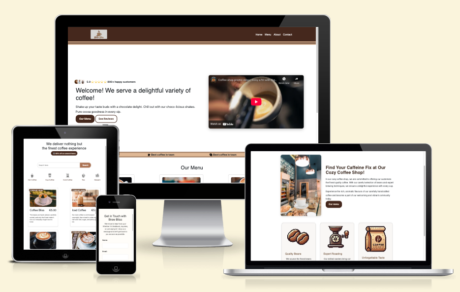

# Brew Bliss Website ☕️

Welcome to **Brew Bliss**, a clean and cozy coffee shop website built with HTML, CSS, and JavaScript. This project showcases a responsive, multi-page layout with dynamic menu and reviews, suitable for small café businesses.

## 🔗 Live Demo

https://paulasdev.github.io/brew-blissWebsite/index.html

## 📁 Project Structure

brew-blissWebsite/

- index.html
- about.html
- contact.html
- menu.html
- css/styles.css
- js/scripts.js
- js/menu.json
- js/reviews.json
- img/cozycoffee.jpg
- img/coffee.png
- img/... (other images)

## 💡 Features

- Responsive design for all devices
- Dynamic menu loaded via JSON
- Customer reviews from a JSON file
- Soft color palette for a welcoming atmosphere

## 🚀 How to Run Locally

1. Clone the repo:
   ```bash
   git clone https://github.com/paulasdev/brew-blissWebsite.git
   cd brew-blissWebsite
   ```

👩‍💻 Author

**Paula Hickey**

⸻

📸 Screenshot

Here’s a preview of the Brew Bliss homepage:



⸻

📄 License

This project is for educational and personal use. Feel free to customize it!
